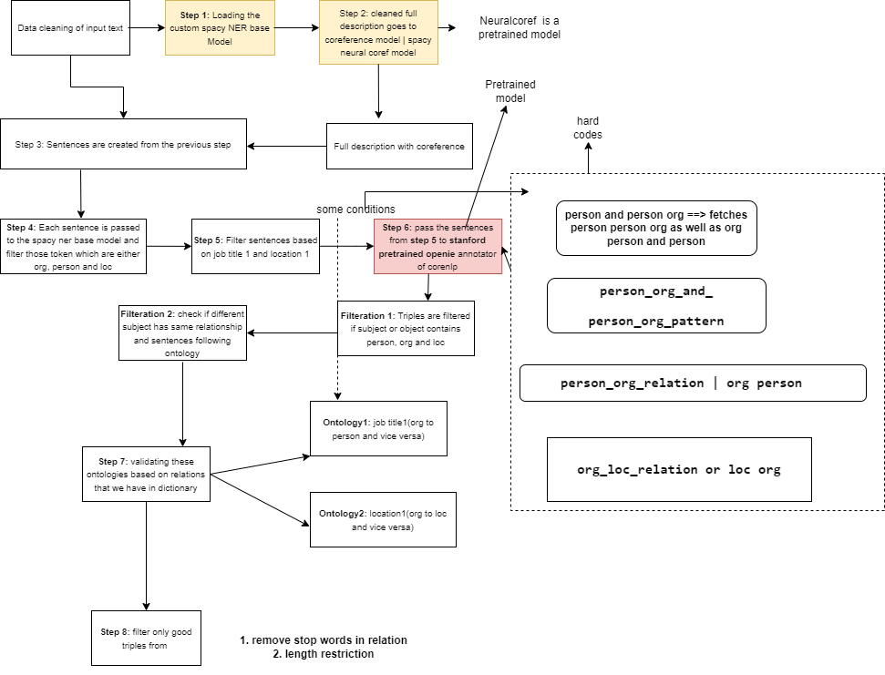

# NLU Orcawise Project

NLU project is developed by [Orcawise](https://www.orcawise.com/) NLP team, which focus on uncovering named entity relations (NER) within the data, leading to the extraction of valuable insights and knowledge. We achieve this by employing both a pre-defined model (StanfordOpenIE) and a fine-tuned model (CustomBertModel). Our primary goal is to extract relations from sentences, specifically targeting four key relationships: managerOf, employedBy, locatedAt, and noRelation.

## Table of Contents
  - [Pretrained OpenIE Model](#pretrained-openie-model)
  - [Custom BERT Model](#custom-bert-model)
  - [Database](#database)
  - [How to Run the Code](#how-to-run-the-code)
    


##  Pretrained OpenIE Model

- **Name:** Stanford OpenIE
- **Description:** The pretrained OpenIE model is based on Stanford's OpenIE library. It extracts relations from input text using natural language processing techniques.
- **Diagram:**
  
 

##  Custom BERT Model

- **Name:** Custom BERT Model
- **Description:** The custom BERT model is fine-tuned for relation classification. It uses the 'bert-base-uncased' pretrained model and has four labels: 'noRelation', 'employedBy', 'managerOf', and 'locatedAt'.
- **Diagram:**
 

## Database

- **Database Used:** MySQL
- **Description:** Open-source relational database management system, widely used for its reliability and scalability. Supports SQL, making it a popular choice for web applications and software projects.

## How to Run the Code

1. **Pretrained OpenIE Model:**
    - Install the requirement library `pip install OpenIE`
    - Install [Java](http://jdk.javTa.net/archive/) in windows.
    - Clone the [core NLP model](https://nlp.stanford.edu/software/stanford-corenlp-4.2.2.zip) and unzip it. Then set the path to unzipped file in environment variables.
    - Run the `nlu_pretrained_model.py` file to initialize and use the OpenIE model.

    ```python
    from nlu_pretrained_model import OpenIEExtractor

    obj1 = OpenIEExtractor()
    text = 'Barack Obama was born in Hawaii.'
    prediction1 = obj1.extract_relations(text)
    print(f"Predicted Relation: {prediction1}")
    ```

2. **Custom BERT Model:**
    - Run the `nlu_custom_model.py` file to initialize and use the Custom BERT model.

    ```python
    from nlu_custom_model import CustomBertModel

    obj2 = CustomBertModel(model_name="bert-base-uncased", num_labels=4, checkpoint_path='path/to/your/checkpoint.ckpt')
    sentence = 'The Colosseum is an ancient amphitheater in Rome.'
    predicted_relation = obj2.predict_relation(sentence)
    print(f"Predicted Relation: {predicted_relation}")
    ```

3. **Connect to database:**
    - **Database Used:** MySQL
    - **Connection from Python with Database:**
        - The database connection is established using the `mysql.connector` library.
        - Connection details:
            - Host: localhost
            - Port: 3306
            - User: root
            - Password: [Password]
            - Database: test_nlu
    - **How to Execute the Code:**
        - Run the `connect_my_sql.py` file to connect to the database, create a table, store predictions, and close the connection.
    
        ```python
        # Example usage
        obj1 = OpenIEExtractor()
        obj2 = CustomBertModel(model_name="bert-base-uncased", num_labels=4, checkpoint_path='path/to/your/checkpoint.ckpt')
    
        sentence = "Finland is often referred to as the 'Land of a Thousand Lakes', but in reality, it has over 188,000 lakes."
        prediction1 = obj1.extract_relations(sentence)
        prediction2 = obj2.predict_relation(sentence)
    
        store_predictions(sentence, prediction2, prediction1)
        ```

    Make sure to replace placeholders such as 'path/to/your/checkpoint.ckpt' and '[Password]' with the actual paths and passwords.
4. **Calculate accuracy:**
    - Run the `accuracy_cal.py` file to calculate the accuracy of the models' results stored in the database.

    ```python
    import mysql.connector
    total_rows = len(accuracy_results)
    acc_custom_total = sum(row[6] for row in accuracy_results)
    acc_pretrained_total = sum(row[7] for row in accuracy_results)

    acc_custom_accuracy = acc_custom_total / total_rows if total_rows > 0 else 0
    acc_pretrained_accuracy = acc_pretrained_total / total_rows if total_rows > 0 else 0

    print(f"Accuracy for acc_custom: {acc_custom_accuracy:.2%}")
    print(f"Accuracy for acc_pretrained: {acc_pretrained_accuracy:.2%}")
    ```   


